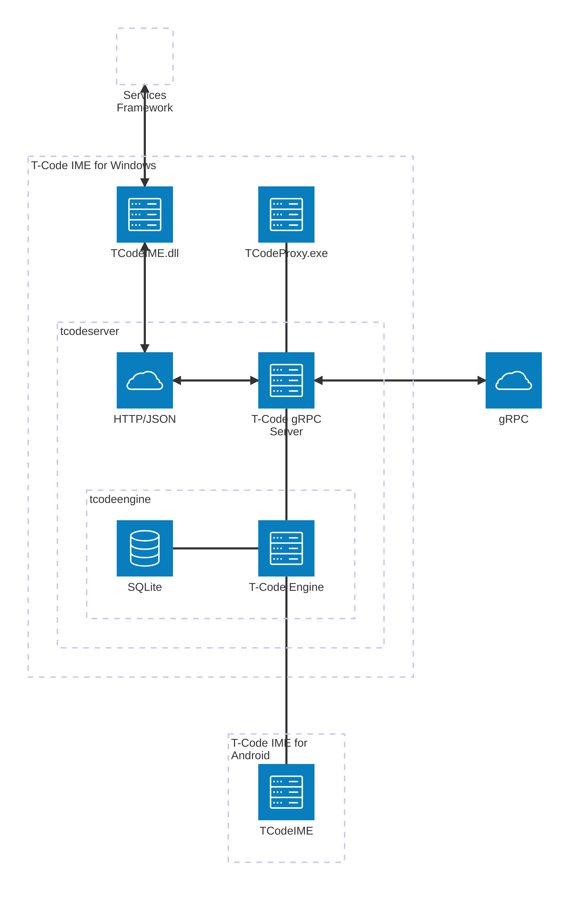

)

# T-Code IME for Windows

This repository contains the T-Code Input Method Editor (IME) for Windows, composed of a native Text Services Framework (TSF) DLL, a C# Proxy Host, and a Java-based T-Code engine.

The entire build, compilation, and installer packaging system is unified under **CMake** with **CMakePresets.json** for multi-architecture support (x64, x86, ARM64).

---

## Prerequisites

To build and package the project, ensure you have the following installed and available on your system `PATH`:
1. **CMake** (v3.20 or newer)
2. **Visual Studio 2022** (with C++ Desktop Development tools)
3. **Inno Setup 6 or 7** — Required to compile the installer package
4. **Java (JDK)** — Required by the T-Code engine

---

## Quick Start (x64)

Configure and build all artifacts for x64 in one go:

```powershell
# 1. Configure
cmake --preset x64

# 2. Build binaries + Inno Setup installer + MSIX package
cmake --build --preset artifacts-x64
```

Outputs:
- `build/x64/Release/TCodeIME.dll` — Native TSF library
- `build/x64/proxy/TCodeProxy.exe` — C# Proxy host
- `installer/output/NicheAppLab.TCodeIME_0.1.1.0_x64.exe` — Traditional installer

---

## Quick Start with Bundled Java Runtime (x64)

If you want a self-contained deployment that includes a minimal Java runtime (no external JRE required), use the `x64-java-runtime` preset:

```powershell
# 1. Configure with JRE bundling enabled
cmake --preset x64-java-runtime

# 2. Build binaries + bundled JRE + installer + MSIX package
cmake --build --preset artifacts-x64-java-runtime
```

This preset runs **jlink** to create a stripped-down JRE (~62 MB) from a JDK installation, then bundles it alongside the engine files. The `tcodeserver.bat` launcher automatically detects and uses the bundled JRE via the `BUNDLED_JVM` environment variable.

Outputs (same paths, but with bundled JRE):
- `build/x64-java-runtime/x64/Release/TCodeIME.dll` — Native TSF library
- `build/x64-java-runtime/x64/proxy/TCodeProxy.exe` — C# Proxy host
- `build/x64-java-runtime/x64/engine/jre/` — Bundled JRE (jlink output)
- `build/x64-java-runtime/x64/engine/bin/` — Engine scripts + custom `tcodeserver.bat` wrapper
- `build/x64-java-runtime/x64/engine/lib/` — Engine libraries
- `installer/output/NicheAppLab.TCodeIME_0.1.1.0_x64_jre.exe` — Inno Setup installer (with bundled JRE)

> **Note**: The `x64-java-runtime` preset is x64-only. For other architectures (x86, ARM64), use the standard presets and provide a system JRE.

---

## Multi-Architecture Builds

The project supports three architectures via CMake presets:

| Architecture | Configure Preset | Build Preset          | Binary Directory   |
|--------------|------------------|-----------------------|--------------------|
| x64 (64-bit) | `x64`            | `artifacts-x64`       | `build/x64/`       |
| x86 (32-bit) | `win32`          | `artifacts-win32`     | `build/win32/`     |
| ARM64        | `arm64`          | `artifacts-arm64`     | `build/arm64/`     |

Additionally, a special x64 preset with a bundled Java runtime is available:

| Variant                    | Configure Preset     | Build Preset               | Binary Directory            | Installer Suffix |
|----------------------------|----------------------|----------------------------|-----------------------------|------------------|
| x64 + bundled JRE          | `x64-java-runtime`   | `artifacts-x64-java-runtime` | `build/x64-java-runtime/x64/` | `_x64_jre` |

### Build for a specific architecture

```powershell
cmake --preset x64
cmake --build --preset artifacts-x64
```

Replace `x64` with `win32` or `arm64` as needed.

### Build all architectures individually

```powershell
# x64
cmake --preset x64 && cmake --build --preset artifacts-x64

# x86
cmake --preset win32 && cmake --build --preset artifacts-win32

# ARM64
cmake --preset arm64 && cmake --build --preset artifacts-arm64
```

---

## Build Targets Reference

| CMake Target                | Description                                    |
|-----------------------------|------------------------------------------------|
| `TCodeIME`                  | Native C++ TSF DLL                             |
| `TCodeProxy`                | C# Proxy host (built automatically)            |
| `BuildBundledJre`           | Create a minimal JRE via jlink (x64-java-runtime only) |
| `BuildInnoInstaller`        | Traditional Inno Setup installer               |
| `GenerateWingetManifests`   | Generate winget-pkgs manifest YAML files       |


---

## Winget Package Manifests

After building all three architectures, generate the winget-pkgs manifest files. The SHA256 is auto-calculated from the built installer files.

```powershell
# 1. Build all architectures
cmake --build --preset artifacts-x64
cmake --build --preset artifacts-win32
cmake --build --preset artifacts-arm64

# 2. Generate winget manifests (SHA256 computed automatically)
cmake --build build/x64 --preset winget

# 3. Upload installers to GitHub release
# 4. Commit generated manifests to winget-pkgs repository
```

Output: `winget/manifests/n/NicheAppLab/T-CodeIME/<version>/*.yaml`

---

## How to Install & Configure

### Installing via Win32 Setup
1. Run `installer/output/NicheAppLab.TCodeIME_0.1.1.0_x64.exe` (requires Administrator privileges).
2. Follow the wizard steps to complete registration.

### Language & JRE Setup
1. **Java Runtime Setup**: If you installed a package **without** a bundled JRE (standard `x64`/`win32`/`arm64` presets), ensure a JRE is installed and `JAVA_HOME` is defined in your environment path. If you installed a **java-runtime** package, the bundled JRE is used automatically — no additional setup needed.
2. **Add Keyboard**: Go to **Settings > Time & Language > Language & Region > Preferred Languages > Options**, and add the **T-Code IME** keyboard.

---

## Building a Custom Bundled Java Runtime

The `x64-java-runtime` preset uses **jlink** to create a minimal JRE. You can customize which JDK and modules are used, or build the runtime manually outside of CMake.

### How it works (CMake integration)

When `TCODE_BUNDLE_JRE=ON` (set by the `x64-java-runtime` preset), the build system:

1. Locates `jlink.exe` in the configured JDK home (`TCODE_JDK_HOME`, defaults to `C:/Program Files/Microsoft/jdk-25.0.3.9-hotspot`).
2. Runs jlink with the configured module list (`TCODE_JLINK_MODULES`) to produce a stripped-down JRE.
3. Stages the engine files (`engine/bin/`, `engine/lib/`) alongside the JRE in the build output.
4. The `C# Proxy` (`TCodeProxy.exe`) detects the bundled JRE at `{engineDir}/jre` and sets `BUNDLED_JVM`, `JAVA_HOME`, and `PATH` before launching the engine. The original `tcodeserver.bat` already supports the `BUNDLED_JVM` variable, so no wrapper is needed.

### Customizing the JDK source

Override the JDK path in your CMake configuration:

```powershell
cmake --preset x64-java-runtime `
    -DTCODE_JDK_HOME="C:/Program Files/Eclipse Adoptium/jdk-21.0.6-hotspot"
```

### Customizing jlink modules

The default module list covers gRPC, Netty, SQLite, and logging. To override:

```powershell
cmake --preset x64-java-runtime `
    -DTCODE_JLINK_MODULES="java.base,java.logging,java.sql,java.naming,java.management,java.xml"
```

### Building the JRE manually with jlink

If you prefer to build the JRE outside of CMake (e.g., for testing or custom packaging):

```powershell
# 1. Locate your JDK's jlink (adjust path as needed)
$jdkHome = "C:\Program Files\Microsoft\jdk-25.0.3.9-hotspot"

# 2. Run jlink to create a minimal JRE
& "$jdkHome\bin\jlink.exe" `
    --add-modules java.base,java.logging,java.sql,java.naming,java.management,java.xml,jdk.unsupported,jdk.zipfs,jdk.charsets,java.net.http,java.scripting,java.instrument,java.security.jgss,java.security.sasl,java.datatransfer,java.desktop,jdk.crypto.ec,jdk.crypto.cryptoki,jdk.crypto.mscapi,jdk.localedata,jdk.management,jdk.management.agent,jdk.naming.dns,jdk.naming.rmi,jdk.sctp,jdk.security.auth,jdk.security.jgss `
    --output "C:\temp\my-tcode-jre" `
    --strip-debug `
    --no-man-pages `
    --no-header-files `
    --compress zip-6
```

This produces a portable JRE directory (~62 MB) at `C:\temp\my-tcode-jre`. You can then place it at `engine/jre/` relative to the T-Code engine scripts, and the `tcodeserver.bat` launcher will automatically pick it up via the `BUNDLED_JVM` detection logic.

### How the bundled JRE is detected at runtime

**`TCodeProxy.exe`** (C# Proxy): Before launching the engine script, checks if `{engineDir}/jre/bin/java.exe` exists. If found, sets `BUNDLED_JVM`, `JAVA_HOME`, and prepends `PATH` with `{bundledJreDir}\bin`. The original `tcodeserver.bat` already supports the `BUNDLED_JVM` environment variable, so no wrapper script is needed.

---

## System Architecture

Here is the system architecture diagram showing how the native Windows TSF DLL, the C# Proxy, the Scala Server/Engine, and the Android App components interact:



---

## Project Structure

- `src/` — Native C++ Text Services Framework (TSF) implementation.
- `proxy/` — C# Proxy UI Host (coordinates named pipe communication between the DLL and the engine).
- `engine/` — T-Code Java engine runtime.
- `installer/` — Inno Setup packaging configurations and installer output.
- `CMakeLists.txt` — Unified root CMake configuration orchestrating the entire build.
- `CMakePresets.json` — Presets for multi-architecture configure, build, and bundle workflows.
